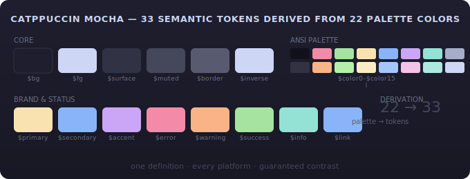

# Swatch

Generate complete color themes from minimal input. Give it **one hex color** or choose from **43 built-in palettes** — swatch derives **33 semantic tokens** with guaranteed contrast and dark/light variants. Terminal, web, native. Zero dependencies.

<p align="center"></p>
<p align="center"><em>Catppuccin Mocha — 22 palette colors derive 33 semantic tokens</em></p>

## Quick Start

```bash
bun add swatch    # or npm i swatch / pnpm add swatch / yarn add swatch
```

### Use a built-in theme

```typescript
import { presetTheme, resolveThemeColor } from "swatch"

// Load a built-in theme
const theme = presetTheme("catppuccin-mocha")

// Use semantic tokens
resolveThemeColor("$primary", theme)   // -> "#F9E2AF"
resolveThemeColor("$error", theme)     // -> "#F38BA8"
resolveThemeColor("$surface", theme)   // -> "#313244"
```

### Generate from minimal input

```typescript
import { createTheme, autoGenerateTheme } from "swatch"

// Builder API — chainable
const theme = createTheme().bg("#2E3440").primary("#EBCB8B").build()

// Single color -> full theme
const theme = autoGenerateTheme("#5E81AC", "dark")
```

### Use a preset with overrides

```typescript
const theme = createTheme()
  .preset("nord")
  .primary("#A3BE8C")
  .build()
```

## Why Swatch?

- **Theme authors** — define as few as **1 color**. Swatch handles contrast, mode adjustments, and all 33 tokens. Fine-tune only what you want.
- **App developers** — use semantic tokens like `$primary` and `$surface` instead of raw hex codes. Swap themes at runtime without changing code.
- **Accessible by default** — every background token has a matching foreground with guaranteed contrast. No more illegible text.

## How It Works

```
  ┌─────────────────────┐
  │   1-3 colors        │
  │   or Base16 YAML    │──────┐
  └─────────────────────┘      │
                               ▼
  ┌─────────────────────┐  ┌───────────┐  ┌──────────────────────────────────┐
  │  43 built-in themes │─▶│ 22-color  │─▶│ 33 semantic design tokens        │
  │  Nord, Catppuccin,  │  │ palette   │  │ $primary $error $surface $border │
  │  Dracula, ...       │  └───────────┘  └──────────────┬───────────────────┘
  └─────────────────────┘                                ▼
                                          ┌──────────────────────────────┐
                                          │ Apps that look great across  │
                                          │ themes, platforms, and modes │
                                          └──────────────────────────────┘
```

Terminal palettes define 22 colors &mdash; a compact, universal format that every theme author already knows. But modern UIs need more: surfaces, borders, status colors, focus rings, selection highlights. Swatch *derives* 33 semantic tokens from those 22 base colors using blending, contrast calculations, and sensible defaults.

Theme authors define what they know. Swatch produces what components need.

## CLI

```bash
npx swatch list                          # list all built-in themes
npx swatch show nord                     # preview a theme's colors
npx swatch generate "#4caf50" --light    # generate a theme from one color
npx swatch import base16-scheme.yaml     # import a Base16 scheme
```

## API

```typescript
import { presetTheme, createTheme, autoGenerateTheme, resolveThemeColor } from "swatch"

// Load a preset
const theme = presetTheme("nord")

// Build from scratch
const theme = createTheme().bg("#2E3440").primary("#EBCB8B").build()

// One color → full theme
const theme = autoGenerateTheme("#5E81AC", "dark")

// Resolve tokens
resolveThemeColor("$primary", theme)  // → hex color
```

Also available: `deriveTheme()`, `fromBase16()`, `exportBase16()`, `themeToCSSVars()`, `validateTheme()`, `checkContrast()`, `detectTerminalPalette()`, and color utilities (`blend`, `brighten`, `darken`, etc.). See the [full API reference](https://beorn.codes/swatch/reference/builder-api).

## Semantic Tokens (33)

Swatch outputs 33 tokens covering all UI needs: backgrounds (`$bg`, `$surface`, `$popover`), text (`$fg` and matching `*fg` variants for every background), brand colors (`$primary`, `$secondary`, `$accent`), status colors (`$error`, `$warning`, `$success`, `$info`), plus `$selection`, `$cursor`, `$border`, `$link`, and more. Every background token has a matching foreground for guaranteed readable text.

See the [full token reference](https://beorn.codes/swatch/reference/semantic-tokens) for details and derivation rules.

## Built-in Palettes (43)

Popular themes including **Catppuccin** (all 4 flavors), **Nord**, **Dracula**, **Solarized**, **Tokyo Night**, **Gruvbox**, **Rose Pine**, **Kanagawa**, and many more. Import any of the **600+ Base16 community schemes** too.

[Browse the theme gallery](https://beorn.codes/swatch/gallery/) to preview all palettes.

## Documentation

- **[Getting Started](https://beorn.codes/swatch/guide/getting-started)** — tutorial with examples
- **[Theme Gallery](https://beorn.codes/swatch/gallery/)** — preview all 43 built-in themes
- [Creating Themes](https://beorn.codes/swatch/guide/creating-themes) — builder API, custom palettes
- [Web Usage](https://beorn.codes/swatch/guide/web-usage) — CSS variables, React integration
- [Design Philosophy](https://beorn.codes/swatch/guide/design-philosophy) — why two layers, why 22 colors

## Inspiration

Terminal emulators (Ghostty, Kitty, Alacritty), shadcn/ui, Base16, and the color communities behind Catppuccin, Nord, and Dracula.

## License

MIT
